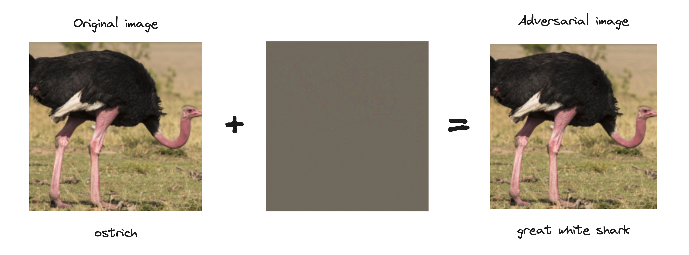

# Adversarial Examples

Create adversarial images that make a neural network misclassify them.




# Installation

To install the library, clone the repository and install the needed dependencies:
```
git clone git@github.com:sebastian-sosa/adversarial-examples.git
cd adversarial_examples
poetry install
```

# Usage

```
import torch
from adversarial.adversarial import create_adversarial_example
from adversarial.utils import load_resnet_and_labels, load_image, predict, to_image

TARGET_CLASS = <desired_target_class>
IMG_PATH = <path_to_image>

model, labels = load_resnet_and_labels()
image = load_image(IMG_PATH)

y_hat = predict(model, image)
print(f'Original image predicted label: {labels[y_hat.item()]}')
display(to_image(image))

adversarial_example = create_adversarial_example(model, image, TARGET_CLASS)
y_hat = predict(model, adversarial_example)

print(f'Adversarial image predicted label: {labels[y_hat.item()]}')
print(labels[y_hat.item()])
display(to_image(adversarial_example))
```

See `example.ipynb` for a complete example.

# License
This project is licensed under the MIT License. See the LICENSE file for details.